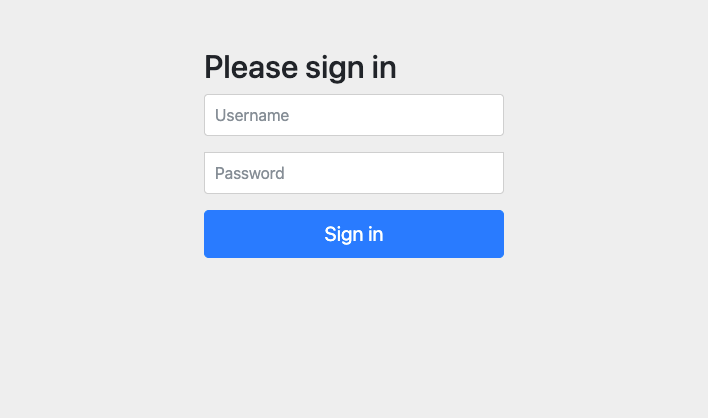
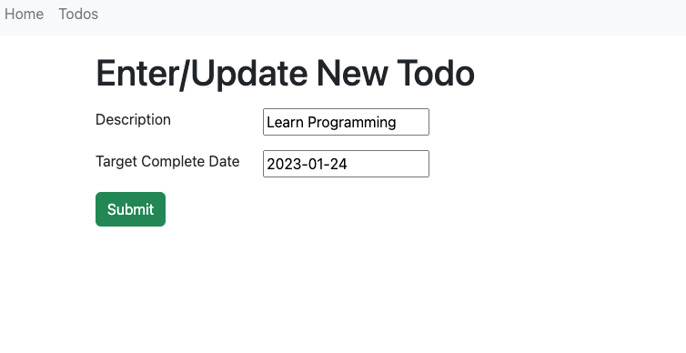
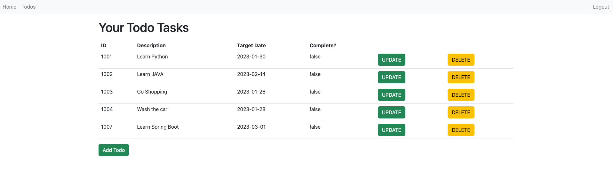

# Todo Application

## Overview
This a simple web-based Todo task management application. It supports multiple user accounts, each user can 
access their own todo list. User are able to create/update/delete/search todo tasks.

Continue Improving...

## Tech Stacks
* JAVA
* MAVEN
* Spring Boot
* JPA, Hibernate
* MySQL
* HTML, CSS

## Screenshot
 

 

 

